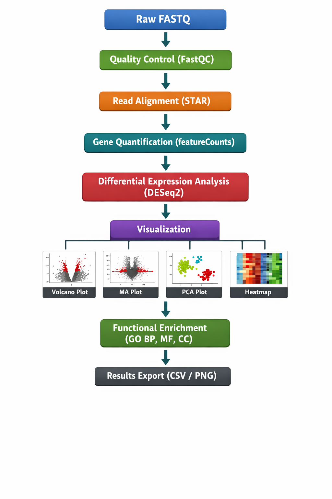
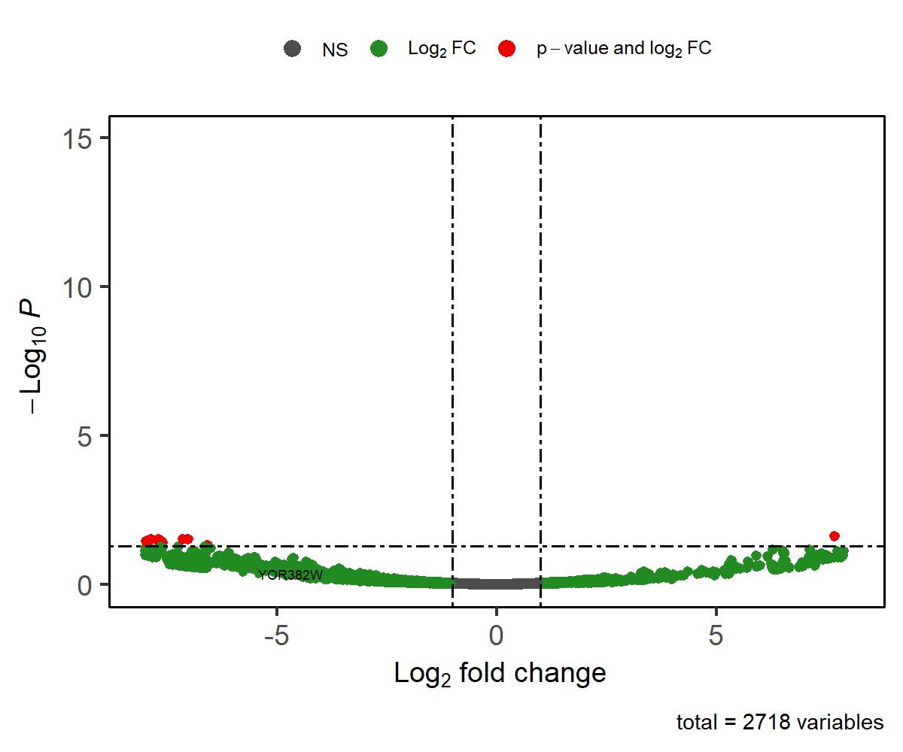
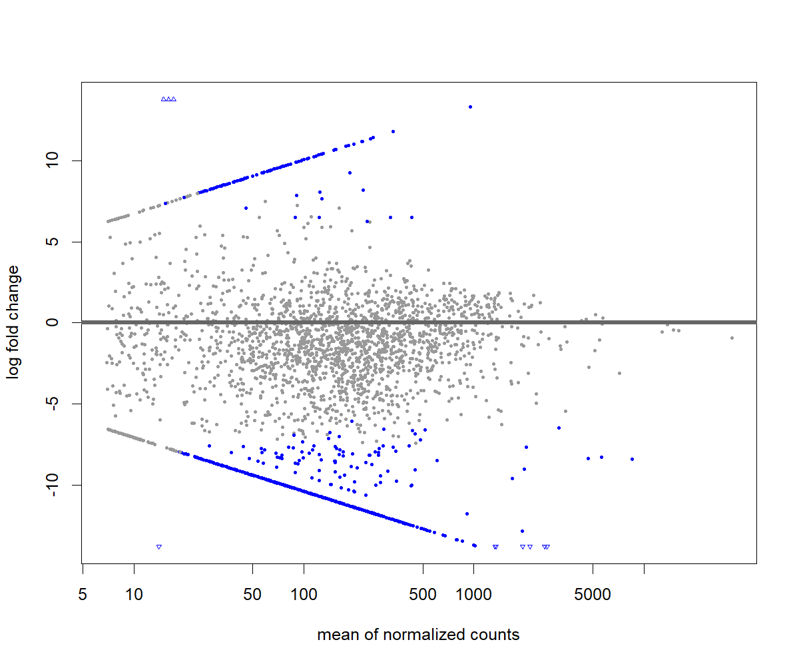
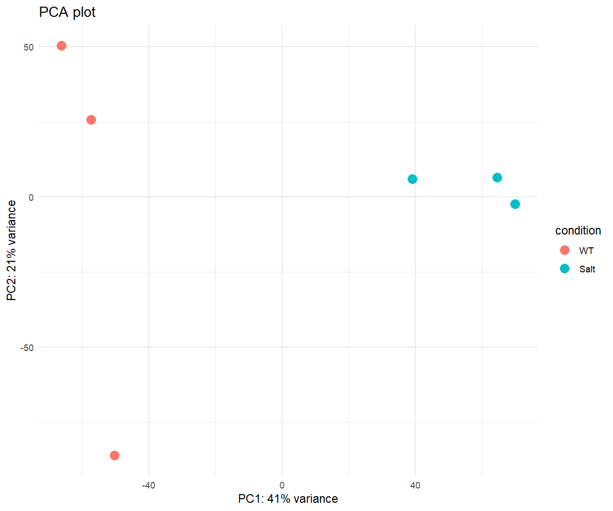
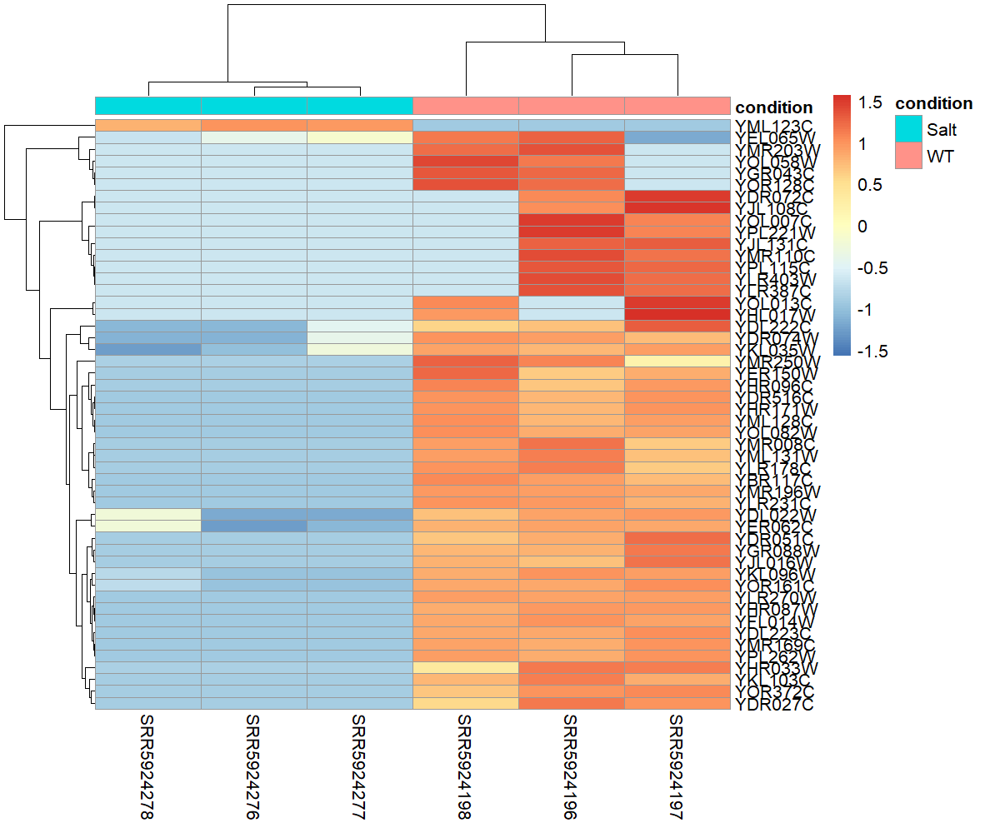

# RNA-seq Analysis Snakemake Pipeline

An end-to-end **RNA-seq differential expression analysis pipeline** built with **Snakemake**. The workflow covers quality control, alignment, quantification, statistical analysis, and functional enrichment, with an emphasis on **reproducibility**, **clarity**, and **practical use**. The pipeline has been tested locally using publicly available *Saccharomyces cerevisiae* RNA-seq data.

**Status:** Tested locally with public *S. cerevisiae* RNA-seq data
**Note:** Users are expected to provide their own input data.

---

## Table of Contents

* [Overview](#overview)
* [Pipeline Features](#pipeline-features)
* [Workflow Overview](#workflow-overview)
* [Folder Structure](#folder-structure)
* [Installation](#installation)
* [Usage](#usage)
* [Sample Plots Preview](#sample-plots-preview)
* [Outputs](#outputs)
* [Dependencies / Tools](#dependencies--tools)
* [Author](#author)
* [License](#license)

---

## Overview

This project implements a complete RNA-seq analysis workflow, starting from raw FASTQ files and ending with differential expression results and functional interpretation. Snakemake is used to manage dependencies between steps, ensuring that analyses are **modular**, **scalable**, and **easy to reproduce**.

The pipeline supports experiments with single or multiple conditions and is suitable for both learning purposes and real-world RNA-seq analyses.

---

## Pipeline Features

* Quality control of raw sequencing reads using **FastQC**
* Alignment of reads to a reference genome with **STAR**
* Gene-level quantification using **featureCounts**
* Differential expression analysis with **DESeq2**
* Visualization of results, including:

  * Volcano plots
  * MA plots
  * PCA plots
  * Heatmaps of top differentially expressed genes
* Functional enrichment analysis (GO Biological Process, Molecular Function, and Cellular Component) using **clusterProfiler**
* Clear separation of results, logs, scripts, and configuration files

---

## Workflow Overview

The diagram below summarizes the vertical structure of the RNA-seq pipeline, from raw data to biological interpretation:



---

## Folder Structure

```text
├── workflow/                 # Snakemake workflow files (rules, modules)
├── Snakefile                 # Main Snakemake entry point
├── counts/                   # Gene count files (featureCounts output)
├── results/                  # Differential expression results and plots
├── images/                   # Plots displayed in README (PCA, volcano, heatmaps)
├── scripts/                  # R scripts (DESeq2, visualization, enrichment)
├── data/                     # Reference genome and annotation files
├── logs/                     # Snakemake log files
├── envs/                     # Conda environment YAML files
│   └── config.yaml           # Pipeline configuration parameters
├── docker/                   # Docker setup for containerized execution
│   ├── Dockerfile            # Containerized environment for reproducibility
│   └── README_Docker.md      # Instructions for running with Docker
├── .gitignore                # Git ignore rules
└── README.md                 # Project documentation
```

---

## Installation

### Required Tools

* [Snakemake](https://snakemake.readthedocs.io/en/stable/)
* [Conda](https://docs.conda.io/en/latest/)
* [FastQC](https://www.bioinformatics.babraham.ac.uk/projects/fastqc/)
* [STAR](https://github.com/alexdobin/STAR)
* [featureCounts](http://bioinf.wehi.edu.au/featureCounts/)
* [R](https://www.r-project.org/) with the following packages:

  * **DESeq2**
  * **clusterProfiler**

All dependencies can be managed automatically using Conda environments defined in the `envs/` directory.

---

## Usage

### 1. Prepare Input Data

Place the following files in the `data/` directory:

* Raw FASTQ files
* Reference genome (FASTA)
* Gene annotation file (GTF)

### 2. Configure the Pipeline

Update the `config.yaml` file with:

* Sample information
* File paths
* Analysis parameters

### 3. Run the Pipeline

For a standard local run using Conda:

```bash
snakemake --use-conda --cores 4
```

If you are using a custom configuration file:

```bash
snakemake --use-conda --configfile envs/config.yaml --cores 4
```

Snakemake will automatically determine which steps need to be executed and will skip completed steps if outputs already exist.

---

## Why This Pipeline?

This pipeline was built to reflect how RNA-seq analyses are performed in real research and industry settings, rather than as a minimal tutorial example. The focus is on clarity, reproducibility, and end-to-end execution.

Key motivations behind this workflow:

* To practice and demonstrate **production-style RNA-seq analysis** using standard, widely adopted tools
* To ensure each step is **transparent and inspectable**, rather than hidden behind black-box scripts
* To make the pipeline easy to adapt to new datasets, organisms, or experimental designs
* To gain hands-on experience with **workflow management**, dependency tracking, and reproducible analysis practices

The project also serves as a portfolio example showcasing practical skills in RNA-seq data processing, statistical analysis, and result interpretation.

---

## Limitations and Future Improvements

While the pipeline covers the core steps of RNA-seq differential expression analysis, there are several areas identified for improvement:

**Current limitations:**

* The pipeline has been tested on yeast RNA-seq data and may require tuning for larger or more complex genomes
* Single-end and paired-end handling is basic and can be further generalized
* Batch effect correction and complex experimental designs are not yet fully implemented
* Downstream analyses are limited to GO enrichment and do not include pathway-level analysis

**Planned improvements:**

* Support for more complex experimental designs in DESeq2 (batch effects, interaction terms)
* Integration of additional QC steps (e.g., MultiQC summary reports)
* Optional transcript-level quantification using tools such as Salmon or kallisto
* Expanded functional analysis (KEGG, Reactome pathways)
* Improved configuration flexibility for larger multi-sample studies

These enhancements are intended to move the pipeline closer to a production-ready workflow while maintaining usability and clarity.

---

## Sample Plots Preview

Examples of plots generated by the pipeline are shown below.

**Volcano Plot**


**MA Plot**


**PCA Plot**


**Heatmap (Top Differentially Expressed Genes)**


---

## Outputs

The pipeline produces the following outputs:

* `results/fastqc/` – FastQC HTML reports and compressed output files
* `counts/` – Gene-level count tables from featureCounts
* `results/deseq2/` – Differential expression results, plots, and summaries
* `logs/` – Detailed Snakemake execution logs

### DESeq2 Analysis Summary

The DESeq2 workflow:

* Reads the raw count matrix and sample metadata
* Filters low-count genes and handles missing values
* Performs differential expression analysis and computes log2 fold changes
* Identifies significantly upregulated and downregulated genes
* Generates PCA, MA, volcano plots, and heatmaps
* Performs GO enrichment analysis (BP, MF, CC) using clusterProfiler
* Saves all results in a structured `results/` directory

---

## Dependencies / Tools

* Snakemake
* Conda
* FastQC
* STAR
* featureCounts
* R (DESeq2, clusterProfiler)
* Python 3.x

---

## Author

**Abishag Jacquline**
[GitHub](https://github.com/Abishag24) | [LinkedIn](https://www.linkedin.com/in/abishagjacquline/)

---

## License

This project is licensed under the **MIT License**.

⚠️ Runtime files, editor artifacts, and intermediate analysis outputs are intentionally excluded from version control to keep the repository clean and fully reproducible.
